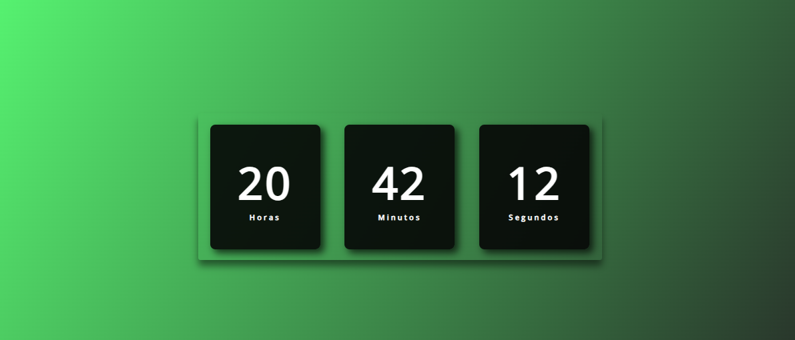

# ⏰ Relógio Digital com HTML, CSS e JavaScript

Esse foi o **meu primeiro projeto utilizando HTML, CSS e JavaScript juntos**, criando um **relógio digital funcional** que mostra a hora em tempo real! Foi um desafio super importante na minha jornada, pois comecei a aplicar na prática a manipulação de **datas e horas com JavaScript**. 🧠💻

## 🧪 Sobre o projeto

O relógio exibe horas, minutos e segundos atualizados automaticamente a cada segundo. Além disso, cuidei para que o visual ficasse limpo e responsivo, com CSS bem organizado.

Esse projeto me ajudou a:

- Praticar **manipulação de tempo** com JavaScript (`Date`);
- Usar o `setInterval()` para atualizar o relógio dinamicamente;
- Trabalhar a integração do **JavaScript com HTML/CSS**;
- Desenvolver a lógica de formatação e exibição dos dados.

## 🛠️ Tecnologias utilizadas

- HTML5
- CSS3
- JavaScript 

## 💻 Demonstração

[🔗 Acesse o projeto](https://yguilhermemacedo.github.io/Relogio-digital/)  

  

## 💭 Considerações

Esse projeto foi essencial para reforçar minha base em JavaScript e me mostrar como é possível construir coisas visuais e úteis com código. Ver o relógio funcionando e saber que fui eu quem fez é aquela sensação boa que só quem programa conhece. 😄

---

> ⚡ Me acompanha aqui no GitHub para ver mais projetos que estou desenvolvendo com foco total no front-end!
